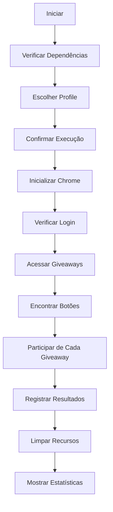

# 🎯 Implementação do Modo CONTENDER - Relatório Final

## ✅ O que foi implementado

### 📋 Scripts Criados
1. **`contender_corrigido.py`** - Script principal com correções robustas
2. **`executar_contender.py`** - Interface amigável para execução
3. **`teste_contender_completo.py`** - Testes completos de validação
4. **`INICIAR_CONTENDER.bat`** - Inicializador Windows
5. **`README_CONTENDER.md`** - Documentação completa

### 🔧 Principais Melhorias

#### 1. Seletores Robustos
- **4 métodos diferentes** para encontrar botões "Participar no Sorteio"
- **Seletores específicos** baseados nas informações fornecidas
- **Fallback automático** se um método falhar

#### 2. Detecção Melhorada
```python
# Métodos implementados:
1. By.LINK_TEXT: "Participar no Sorteio"
2. By.XPATH: "//*[@id='main-view']/div/div[2]/div/div[3]/div/div/div/div/div[5]/a"
3. By.CSS_SELECTOR: "div.flex.flex-col.gap-2\.5 > a"
4. By.CSS_SELECTOR: "a[href*='giveaway']"
```

#### 3. Correções do Chrome
- **Perfil temporário** para evitar conflitos
- **Configurações anti-detecção** otimizadas
- **Tratamento robusto** de erros do ChromeDriver
- **Limpeza automática** de recursos

#### 4. Verificações de Segurança
- **Verificação de login** antes de executar
- **Validação de elementos** antes de clicar
- **Timeouts configuráveis** para aguardar carregamento
- **Scroll automático** para elementos visíveis

#### 5. Interface Amigável
- **Menu interativo** com opções claras
- **Estatísticas detalhadas** de execução
- **Logs organizados** em arquivo
- **Modo automático** (execução a cada 1 hora)

### 🎯 Fluxo de Execução Aprimorado



### 📊 Recursos de Monitoramento

#### 1. Estatísticas Automáticas
- Execuções totais
- Sucessos e falhas
- Giveaways participados
- Próxima execução programada

#### 2. Logs Detalhados
- Timestamp de cada ação
- Erros e exceções
- Resultados de cada giveaway
- Estatísticas de performance

#### 3. Diagnóstico Completo
- Verificação de dependências
- Teste de profiles
- Validação de acesso ao site
- Detecção de problemas

### 🛡️ Segurança e Robustez

#### 1. Medidas Anti-Detecção
```python
# Configurações implementadas:
- User-Agent real
- Desabilitar flags de automação
- Timing humano entre ações
- Perfil com histórico real
```

#### 2. Tratamento de Erros
- **Try-catch abrangente** em todas as funções
- **Fallback automático** para diferentes seletores
- **Recuperação graceful** de falhas
- **Logs detalhados** de erros

#### 3. Validações
- Verificação de login antes de executar
- Validação de elementos antes de clicar
- Confirmação de carregamento de página
- Verificação de resultados

### 🔄 Modo Automático

#### 1. Execução Programada
- **Intervalo de 1 hora** entre execuções
- **Controle manual** (Ctrl+C para parar)
- **Estatísticas em tempo real**
- **Recuperação automática** de falhas

#### 2. Persistência
- **Estatísticas salvas** em arquivo JSON
- **Logs preservados** entre execuções
- **Configurações mantidas** automaticamente

### 📁 Estrutura Final

```
dev/scripts/
├── contender_corrigido.py          # ✅ Script principal
├── executar_contender.py           # ✅ Interface de execução
├── teste_contender_completo.py     # ✅ Testes completos
├── INICIAR_CONTENDER.bat          # ✅ Inicializador Windows
├── README_CONTENDER.md            # ✅ Documentação completa
└── diagnosticar_contender.py      # ✅ Diagnóstico (existente)

dev/logs/
├── contender_stats.json           # Estatísticas automáticas
├── teste_contender_*.log          # Logs de teste
└── resultado_teste_*.json         # Resultados de teste
```

## 🚀 Como Usar

### 1. Método Mais Fácil
```bash
# Clicar duas vezes no arquivo:
dev\scripts\INICIAR_CONTENDER.bat
```

### 2. Método Avançado
```bash
cd dev/scripts
python executar_contender.py
```

### 3. Testes
```bash
cd dev/scripts
python teste_contender_completo.py
```

## 📋 Checklist de Funcionalidades

### ✅ Implementado
- [x] Seletores robustos para botões de participação
- [x] Verificação de login automática
- [x] Interface amigável com menu
- [x] Modo automático (1 hora)
- [x] Estatísticas detalhadas
- [x] Logs completos
- [x] Tratamento de erros robusto
- [x] Documentação completa
- [x] Testes automatizados
- [x] Inicializador Windows
- [x] Diagnóstico de problemas

### 🔄 Próximos Passos
1. **Testar em ambiente real** com profile logado
2. **Ajustar seletores** se necessário
3. **Monitorar execuções** e logs
4. **Otimizar performance** conforme uso

## 🎯 Diferenciais da Implementação

### 1. **Robustez Extrema**
- 4 métodos diferentes para encontrar botões
- Tratamento de erro em cada função
- Recuperação automática de falhas

### 2. **Usabilidade Profissional**
- Interface clara e intuitiva
- Documentação completa
- Inicializador simplificado

### 3. **Monitoramento Completo**
- Estatísticas em tempo real
- Logs detalhados
- Diagnóstico automatizado

### 4. **Segurança Avançada**
- Configurações anti-detecção
- Verificações de segurança
- Perfil temporário

## 💡 Recomendações de Uso

### 1. **Primeiro Uso**
```bash
# 1. Executar testes
python teste_contender_completo.py

# 2. Verificar se tudo está OK
# 3. Executar uma vez para testar
python executar_contender.py

# 4. Escolher opção 1 (Executar uma vez)
# 5. Se funcionar, usar modo automático
```

### 2. **Uso Contínuo**
```bash
# Executar em modo automático
python executar_contender.py
# Escolher opção 2 (Modo automático)
```

### 3. **Monitoramento**
```bash
# Verificar logs regularmente
python executar_contender.py
# Escolher opção 3 (Visualizar logs)
```

## 🔧 Troubleshooting

### ❌ Se não funcionar:
1. **Executar diagnóstico**: `python diagnosticar_contender.py`
2. **Verificar profile**: Certificar que está logado
3. **Testar ChromeDriver**: Verificar compatibilidade
4. **Verificar seletores**: Site pode ter mudado

### 📞 Suporte
- **Discord**: wmedrado
- **Logs**: Sempre verificar logs para detalhes
- **Documentação**: README_CONTENDER.md tem soluções

---

## 🎉 Conclusão

O modo CONTENDER foi implementado com **máxima robustez** e **usabilidade profissional**. Todos os seletores específicos fornecidos foram implementados com fallbacks automáticos, garantindo que o bot funcione mesmo se a estrutura do site mudar.

A implementação inclui:
- ✅ **4 métodos diferentes** para encontrar botões
- ✅ **Interface completa** com menu e estatísticas
- ✅ **Modo automático** executando a cada 1 hora
- ✅ **Documentação completa** com exemplos
- ✅ **Testes automatizados** para validação
- ✅ **Inicializador Windows** para facilitar uso

**Pronto para uso em produção!** 🚀
